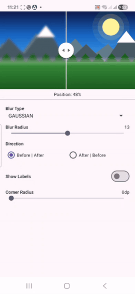

<div align="center">

# RevealSlider

### A production-ready Android before/after image comparison slider



[](https://jitpack.io/#theadityatiwari/RevealSlider)
[](https://android-arsenal.com/api?level=24)
[](LICENSE)
[](https://github.com/theadityatiwari/RevealSlider/actions/workflows/build.yml)

</div>

---

A single draggable divider splits one image into a **blurred/styled left half** and a **sharp right half**.
Drag the handle to reveal more or less of each side. Four effect types, fully customisable, zero heavy dependencies.

## Contents

- [Features](#features)
- [Installation](#installation)
- [Quick Start](#quick-start)
- [Blur Types](#blur-types)
- [XML Attributes](#xml-attributes)
- [Programmatic API](#programmatic-api)
- [Jetpack Compose](#jetpack-compose)
- [Glide & Coil Integration](#glide--coil-integration)
- [How It Works](#how-it-works)
- [License](#license)

---

## Features

- **4 effect types** — Gaussian, Frosted Glass, Dark Fade, Pixelate
- **GPU-accelerated blur** — `RenderEffect` on API 31+, `RenderScript` fallback on API 24-30, pure-software box-blur as final fallback
- **Jetpack Compose** wrapper included (zero extra boilerplate)
- **Zero heavy dependencies** — no Glide, Coil or Picasso required
- **Async computation** — `onDraw` only clips and blits; no work done per frame
- **Fully customisable** — divider colour/width, handle size/icon, labels, corner radius, direction
- **minSdk 24** — works on 99 %+ of active Android devices

---

## Installation

### Step 1 — Add JitPack to your settings

In `settings.gradle.kts`:

```kotlin
dependencyResolutionManagement {
    repositories {
        google()
        mavenCentral()
        maven { url = uri("https://jitpack.io") }
    }
}
```

### Step 2 — Add the dependency

```kotlin
dependencies {
    implementation("com.github.theadityatiwari:RevealSlider:1.0.0")
}
```

---

## Quick Start

### XML

```xml
<com.theadityatiwari.revealslider.RevealSliderView
    android:id="@+id/slider"
    android:layout_width="match_parent"
    android:layout_height="240dp"
    app:revealSrc="@drawable/my_photo"
    app:blurType="gaussian"
    app:blurRadius="15"
    app:cornerRadius="12dp"
    app:showLabels="true"
    app:initialPosition="0.5" />
```

### Programmatic

```kotlin
binding.slider.apply {
    setBitmap(myBitmap)
    setBlurType(BlurType.FROSTED_GLASS)
    setBlurRadius(18f)
    setCornerRadius(resources.getDimension(R.dimen.radius_16))
    setShowLabels(true)
    setOnSliderChangeListener(object : RevealSliderView.OnSliderChangeListener {
        override fun onSliderMoved(position: Float) {
            // 0.0f = fully left  |  1.0f = fully right
        }
    })
}
```

---

## Blur Types

| Type | Effect | Configurable via |
|------|--------|-----------------|
| `GAUSSIAN` | Smooth Gaussian blur | `app:blurRadius` (1–25) |
| `FROSTED_GLASS` | Gaussian blur + white overlay | `app:blurRadius`, `app:frostedAlpha` (0–255) |
| `DARK_FADE` | Gaussian blur + dark overlay | `app:blurRadius`, `app:darkFadeAlpha` (0–255) |
| `PIXELATE` | Pixel-block mosaic, no blur | `app:pixelSize` (2–48) |

---

## XML Attributes

| Attribute | Type | Default | Description |
|-----------|------|---------|-------------|
| `app:revealSrc` | reference | — | Drawable/bitmap source |
| `app:sliderScaleType` | enum | `center_crop` | `center_crop` or `fit_center` |
| `app:blurType` | enum | `gaussian` | Effect type (see table above) |
| `app:blurRadius` | float | `15` | Gaussian radius, 1–25 |
| `app:frostedAlpha` | integer | `120` | White overlay alpha, 0–255 |
| `app:darkFadeAlpha` | integer | `140` | Dark overlay alpha, 0–255 |
| `app:pixelSize` | integer | `16` | Pixel block size for PIXELATE |
| `app:dividerWidth` | dimension | `2dp` | Divider line thickness |
| `app:dividerColor` | color | `#FFFFFF` | Divider line colour |
| `app:handleIcon` | reference | — | Custom drawable for the handle |
| `app:handleSize` | dimension | `44dp` | Handle circle diameter |
| `app:handleColor` | color | `#FFFFFF` | Handle fill colour |
| `app:cornerRadius` | dimension | `0dp` | Rounded corners on the view |
| `app:sliderDirection` | enum | `before_after` | `before_after` or `after_before` |
| `app:initialPosition` | float | `0.5` | Starting position, 0.0–1.0 |
| `app:showLabels` | boolean | `false` | Show Before/After labels |
| `app:beforeLabel` | string | `"Before"` | Label text for styled side |
| `app:afterLabel` | string | `"After"` | Label text for sharp side |
| `app:labelTextColor` | color | `#FFFFFF` | Label text colour |
| `app:labelTextSize` | dimension | `14sp` | Label font size |
| `app:labelBackground` | color | `#80000000` | Label background colour |

---

## Programmatic API

```kotlin
// Image
slider.setBitmap(bitmap)

// Effect
slider.setBlurType(BlurType.DARK_FADE)
slider.setBlurRadius(20f)          // 1f..25f
slider.setFrostedAlpha(150)        // 0..255
slider.setDarkFadeAlpha(160)       // 0..255
slider.setPixelSize(24)            // ≥ 2

// Divider
slider.setDividerColor(Color.WHITE)

// Handle
slider.setHandleColor(Color.WHITE)
slider.setHandleSize(48f)          // pixels

// Layout
slider.setCornerRadius(32f)        // pixels
slider.setDirection(SliderDirection.AFTER_BEFORE)
slider.setDividerPosition(0.3f)    // 0f..1f
slider.setShowLabels(true)
slider.setBeforeLabel("Original")
slider.setAfterLabel("Edited")

// Callback
slider.setOnSliderChangeListener(object : RevealSliderView.OnSliderChangeListener {
    override fun onSliderMoved(position: Float) { /* 0f..1f */ }
})
```

---

## Jetpack Compose

```kotlin
RevealSlider(
    bitmap = myBitmap,
    blurType = BlurType.GAUSSIAN,
    blurRadius = 15f,
    dividerColor = Color.White,
    handleSize = 44.dp,
    cornerRadius = 12.dp,
    showLabels = true,
    beforeLabel = "Before",
    afterLabel = "After",
    direction = SliderDirection.BEFORE_AFTER,
    modifier = Modifier
        .fillMaxWidth()
        .height(240.dp),
    onSliderMoved = { position -> /* 0f..1f */ },
)
```

---

## Glide & Coil Integration

RevealSlider accepts any `Bitmap`. Load images with your preferred library.

### Glide

```kotlin
Glide.with(context)
    .asBitmap()
    .load(imageUrl)
    .into(object : CustomTarget<Bitmap>() {
        override fun onResourceReady(resource: Bitmap, transition: Transition<in Bitmap>?) {
            slider.setBitmap(resource)
        }
        override fun onLoadCleared(placeholder: Drawable?) {}
    })
```

### Coil

```kotlin
val request = ImageRequest.Builder(context)
    .data(imageUrl)
    .target { drawable -> slider.setBitmap(drawable.toBitmap()) }
    .build()
imageLoader.enqueue(request)
```

---

## How It Works

1. `setBitmap()` is called → triggers async work on a background `HandlerThread`
2. The bitmap is **scaled once** to the view's dimensions (CENTER_CROP or FIT_CENTER)
3. The **blur/effect is applied once** to the scaled copy and stored as `styledBitmap`
4. `onDraw()` only **clips the canvas** at the divider position and blits the two pre-computed bitmaps — zero computation per frame

A **generation counter** ensures rapid changes (e.g. seeking a SeekBar) never write stale results over newer ones.

**Blur chain:**

| Condition | Path |
|-----------|------|
| API 31+ | `HardwareRenderer` + `RenderEffect.createBlurEffect` (GPU) |
| API 24–30 | `android.renderscript.ScriptIntrinsicBlur` |
| Fallback | 3-pass optimised box blur (O(w·h) per pass, software) |

---

## License

```
MIT License — Copyright (c) 2026 Aditya Tiwari
```

See [LICENSE](LICENSE) for full text.
